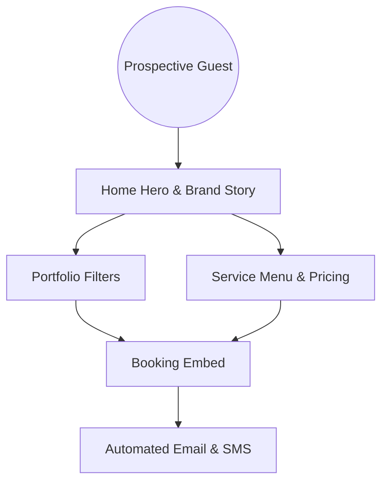

# The Lums Charms – Luxe Nail Atelier Experience

   

> A whimsical digital blueprint for The Lums Charms nail salon, blending playful luxury, storytelling, and conversion-ready booking flows across every device.

## 📚 Table of Contents
- **Experience at a Glance** – [Jump](#-experience-at-a-glance)
- **Tech Stack Highlights** – [Jump](#-tech-stack-highlights)
- **Signature Client Journey** – [Jump](#-signature-client-journey)
- **Quick Start** – [Jump](#-quick-start)
- **Configure Environment Variables** – [Jump](#-configure-environment-variables)
- **Directory Snapshot** – [Jump](#-directory-snapshot)
- **Design & Research Assets** – [Jump](#-design--research-assets)
- **UI Component System** – [Jump](#-ui-component-system)
- **Roadmap & Operations** – [Jump](#-roadmap--operations)
- **Contributing & Support** – [Jump](#-contributing--support)
- **Contact** – [Jump](#-contact)

## ✨ Experience at a Glance
- **Playful luxury storytelling**: Narrative-driven hero moments, immersive galleries, and animated charm details inside `src/app/page.tsx` bring the brand voice to life.
- **Conversion-ready booking flows**: Persistent calls to action, deep-linkable portfolio filters, and an embeddable booking surface keep visitors on the path to scheduling.
- **Scalable content architecture**: Modular page files, environment-driven integrations, and headless CMS readiness (`Sanity`) keep services, testimonials, and posts easy to extend.
- **Polished UI motion language**: `framer-motion` micro-interactions, magnetic buttons, and glassmorphism cards inside `src/components/ui/` add premium delight.
- **Research-backed decisions**: Discovery, UX, and UI documentation in `docs/` ensure every release aligns with audience insights and brand goals.

## 🛠️ Tech Stack Highlights
| Layer | Tooling | Why it matters |
| --- | --- | --- |
| Framework | Next.js 14 (App Router) | Hybrid SSG/SSR for fast, discoverable pages with incremental updates. |
| Styling | Tailwind CSS + custom tokens | Speedy iteration with theme consistency across marketing and transactional pages. |
| Animation | Framer Motion 11 | Elevated motion design for hero reveals, portfolios, and call-to-action feedback. |
| CMS Ready | Sanity (headless) | Structured content models for services, testimonials, and stories. |
| Booking | GlossGenius (embed) | Trusted salon scheduling that keeps the workflow on-brand. |
| Analytics | GA4 • Meta Pixel • Hotjar | Conversion tracking, retargeting, and heatmap insights for optimization cycles. |

## 🧭 Signature Client Journey


## 🚀 Quick Start
1. **Clone the repo** – `git clone <repo-url> && cd lums-charms`
2. **Install dependencies** – `npm install` (or `yarn install`).
3. **Create the env file** – `cp .env.local.example .env.local` and fill in your credentials.
4. **Run locally** – `npm run dev` then open [http://localhost:3000](http://localhost:3000).
5. **Build for production** – `npm run build && npm run start` when you are ready to ship.

> ℹ️ Dive into `DEPLOYMENT.md` for detailed deployment scenarios, performance checklists, and launch tips.

## 🔐 Configure Environment Variables
- **Copy the template**: `.env.local.example` enumerates booking URLs, analytics IDs, contact channels, and CMS secrets.
- **Secure secrets**: Never commit `.env.local`; add provider keys (Sanity, email, maps) per environment.
- **Sync with hosting**: Mirror variables in your Vercel, Netlify, or self-hosted configuration to keep builds consistent.

## 📂 Directory Snapshot
```text
lums-charms/
├─ docs/
│  ├─ discovery/
│  ├─ ux/
│  ├─ ui/
│  ├─ delivery/
│  └─ assets/
├─ project-management/
├─ public/
├─ src/
│  ├─ app/
│  ├─ components/
│  ├─ integrations/
│  ├─ lib/
│  └─ styles/
├─ DEPLOYMENT.md
├─ README.md
└─ package.json
```
- **docs/**: Research, UX flows, UI specs, delivery plans, and asset briefs that guide creative and product choices.
- **project-management/**: Backlogs, sprint boards, and meeting notes to align delivery cadence.
- **public/**: Static assets and SEO helpers (e.g., `robots.txt`).
- **src/app/**: App Router pages, including the marketing experience and shared content guidelines (`shared-components.md`).
- **src/components/**: Reusable motion-rich UI primitives like `GlowButton`, `GlassCard`, and animated sections.
- **src/integrations/**: Integration stubs and configuration helpers for third-party services.
- **src/styles/**: Tailwind base layers, tokens, and global styles to keep the brand palette cohesive.

## 🎨 Design & Research Assets
- **Vision & goals** – `docs/discovery/vision-goals.md` outlines KPIs, guiding principles, and strategic considerations.
- **Audience insights** – `docs/discovery/audience-personas.md` captures personas, motivations, and decision drivers.
- **Competitive landscape** – `docs/discovery/competitive-analysis.md` informs differentiation and positioning.
- **Experience architecture** – `docs/ux/sitemap-userflows.md` and wireframes in `docs/ux/` chart page structure and responsive flows.
- **UI system** – `docs/ui/` documents tokens, component states, motion guidance, and brand treatments.

## 🧩 UI Component System
- **Shared guidelines** – `src/app/shared-components.md` lists canonical components, usage notes, and accessibility checks.
- **Interactive primitives** – `src/components/ui/` hosts hover states, parallax sections, animated cards, and magnetic buttons.
- **Styling foundation** – `tailwind.config.ts` centralizes color stories, typography scales, gradients, and shadows.

## 📈 Roadmap & Operations
- **Backlog grooming** – `project-management/backlog.csv` seeds epics, user stories, and acceptance criteria.
- **Sprint snapshots** – `project-management/sprint-board.csv` tracks work-in-progress and handoffs.
- **Meeting notes** – `project-management/meeting-notes/` captures decisions, blockers, and follow-ups.
- **Release readiness** – `DEPLOYMENT.md` provides launch checklists, performance hygiene, and maintenance rituals.

## 🤝 Contributing & Support
- **Set coding standards** – Run `npm run lint` before committing to keep the codebase aligned with Next.js conventions.
- **Document UX intent** – Update relevant files in `docs/` when flows or visuals evolve to keep stakeholders in sync.
- **Open discussions** – Use issues or meeting notes to log questions about integrations, booking logic, or CMS schemas.
- **Request guidance** – Ping the technical architect for architectural changes or new dependency approvals.

## 📞 Contact
- **Product & UX** – Coordinate with the UX lead for brand, content, or experience updates.
- **Engineering** – Reach out to the technical architect for implementation, deployment, or integration questions.
- **Salon Team** – Align with The Lums Charms staff on scheduling, service details, and promotional campaigns.
