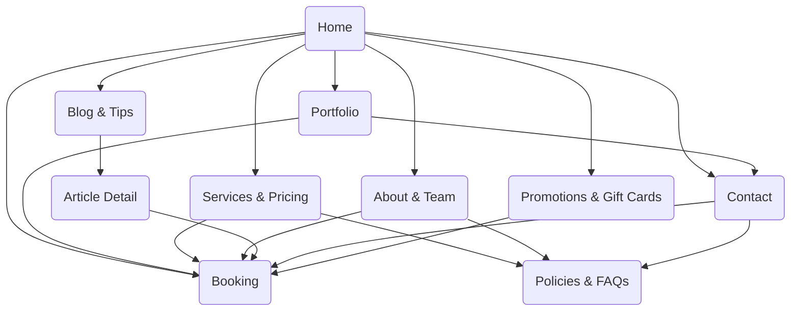

# Sitemap & User Flows — The Lums Charms

## Sitemap Overview

## Primary User Flows

### Flow 1: Discover to Book
1. **Entry Point**: `Home` hero CTA or featured service card.
2. **Explore**: Scroll through signature looks, testimonials, hygiene protocols.
3. **Decision**: Review `Services` for pricing and duration details.
4. **Action**: Click persistent `Book Now` CTA leading to `Booking` embed.
5. **Confirmation**: Complete appointment form; receive confirmation email/SMS.

### Flow 2: Social Inspiration to Service Selection
1. **Entry Point**: Social media link deep-links to `Portfolio` filter.
2. **Explore**: Apply filters (e.g., Bridal, Seasonal, Statement) and open lightbox details.
3. **Decision**: Read technician profile snippet and recommended service.
4. **Action**: Use contextual `Book with [Technician]` CTA heading to `Booking` with pre-selected service.

### Flow 3: First-Time Visitor Confidence
1. **Entry Point**: Organic search landing on `Home` or `About`.
2. **Explore**: View brand story, team bios, salon environment images.
3. **Decision**: Verify hygiene policies, read FAQs in `Policies`.
4. **Action**: Proceed to `Booking` or `Contact` for questions.
5. **Follow-up**: Receive welcome email with preparation tips and cancellation policy.

### Flow 4: Content Consumption & Lead Capture
1. **Entry Point**: Blog article via search or newsletter.
2. **Engage**: Read article, view related posts, watch embedded reels.
3. **Conversion**: Subscribe to newsletter via inline form.
4. **Action**: Click CTA to view `Services` or `Booking`.

## Secondary Flows
- **Group Event Planning**: `Services` → `Promotions` (event packages) → `Contact` form → follow-up scheduling.
- **Gift Purchase**: `Home` promo banner → `Promotions` gift card section → external checkout or form submission.
- **Customer Support**: `Contact` → choose chat/phone/email → escalate to CRM for follow-up.

## Navigation Guidelines
- Sticky top navigation with hero-level quick links (`Services`, `Portfolio`, `Book Now`).
- Secondary footer navigation for `Policies`, `Accessibility`, `Careers`.
- Responsive mobile drawer with prioritized CTAs and social icons.
